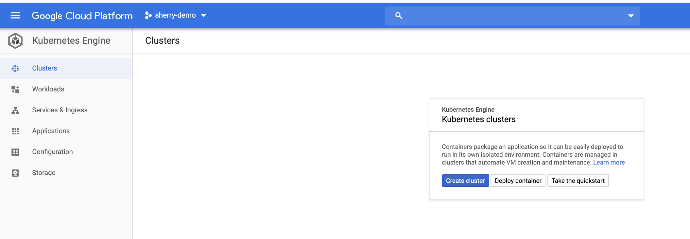
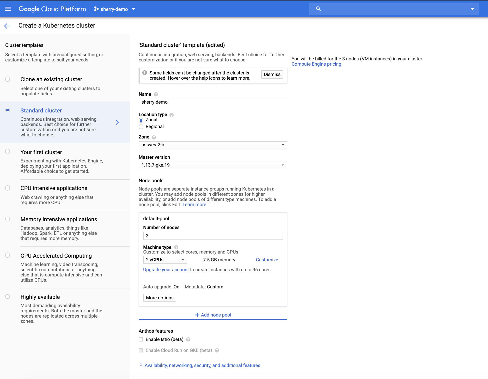

# Goal
Collect logs, metrics, and APM data from a Kubernetes environment, and the application(s) running in that environment and store, analyze, and visualize the resulting information in Elastic Cloud on Kubernetes, which provides a Kubernetes Operator to deploy and manage Elasticsearch and Kibana in k8s.


# About GKE
GKE == Google Kubernetes Engine. [Google Cloud platform offers a free tier and $300 credit](https://cloud.google.com/free/)
In this workshop, we will take advantage of the $300 credit to spin up a Kubernetes cluster on GKE.  If you have never used GKE, you might want to go through the [GKE quickstart](https://cloud.google.com/kubernetes-engine/docs/quickstart).  

# Deploy a k8s cluster in GKE

## Create your k8s cluster
Open https://console.cloud.google.com/kubernetes/ and create a cluster. See screenshots below:

Go to the "Kuberentes Engine" page, click on "CREATE CLUSTER":



Give your cluster a name.



You can accept the defaults with these exceptions:

- Give the cluster a good name
- Use the latest `Master Version` (at the time of writing, this is 1.13.7-gke.19)
- 2 vCPUs per node (this will change the Memory to 7.5GB)
- Under `Availability, networking, security, and additional features` disable `Stackdriver legacy features` as we will be collecting our own logs and metrics.

## Connect to your k8s cluster
When the cluster is ready click on the `Connect` button in the [console](https://console.cloud.google.com/kubernetes/).  ## Connect to your k8s cluster.

1. The connection string from the console should look like similar to the following:

```gcloud container clusters get-credentials <CLUSTER_NAME> --zone <DEFAULT_ZONE> --project <PROJECT_NAME>```

By default, the credentials are written to `HOME/.kube/config`  For details, please see (https://cloud.google.com/sdk/gcloud/reference/container/clusters/get-credentials)

2. Create a cluster level role binding so you can edit system level namespace.

```kubectl create clusterrolebinding cluster-admin-binding  --clusterrole=cluster-admin --user=<USER_NAME>```

Usually, <USER_NAME> is the email address of the user.

## Grab the GitHub repo

This README and the files needed for the demo app are in sherryger/ECK-Workshop. (The orginal repo is located at elasic/examples.) Clone the repo:
```
mkdir ECK-Workshop
cd ECK-Workshop
git clone https://github.com/sherry-ger/ECK-Workshop.git
cd ECK-Workshop/eck-gcp
```

# Deploy your Elasticsearch cluster, APM Server, and Kibana Server
First you will deploy the Elastic Cloud on Kubernetes operator, and then use the operator to deploy Elasticsearch and Kibana

## Deploy the Elastic Cloud on Kubernetes Operator

```bash
kubectl apply -f all-in-one.yaml
```

You will see several `CRDs` deployed, these are Custom Resource Definitions which extend the Kubernetes API to allow best practice Elasticsearch clusters, APM Server, and Kibana servers to be deployed.  The operator will then be started in its own k8s namespace, `elastic-system`.  

Check the logs:

```
kubectl logs -f elastic-operator-0 -n elastic-system
```
When you see `starting the webhook server` you can `CTRL-C` from the log tail and continue.

# Setup persistent storage

Elasticsearch should have persistent storage, and it should be fast.  Google allows SSDs to be used, and `storageClassSSD.yaml` will create a `Storage Class` that uses SSDs.

```
kubectl apply -f storageClassSSD.yaml
```

Once this is applied, SSD based persistent storage can be requested by adding this little bit to the YAML used to request an Elasticsearch cluster (you will see this in context when the cluster gets deployed):

```
...
volumeClaimTemplates:
- metadata:
    name: data
  spec:
    accessModes: [ "ReadWriteOnce" ]
    storageClassName: "ssd"
    resources:
      requests:
        storage: 200Gi
```

If you want to save money, you can use standard storage as well.  To create a `Storage Class` that uses standard storage:

```
kubectl apply -f storageClassStandard.yaml
```

In the Elasticsearch configuration file, use the following to deploy with standard storage.

```
volumeClaimTemplates:
- metadata:
    name: data
  spec:
    accessModes: [ "ReadWriteOnce" ]
    storageClassName: "hdd"
    resources:
      requests:
        storage: 200Gi
```

# Deploy the Elastic Stack

## Elasticsearch cluster

Please have a look at `elasticsearch.yaml` file.

- The type of thing being deployed is Elasticsearch
- The name of the cluster is `elasticsearch-sample`
- Use version 7.3.0
- Make this a three node cluster, with 1 hot node and 2 warm nodes
- Mount a 20Gi volume `data` on both hot and warm nodes.  Please note, in production, we will be using ssd storage for hot nodes and standard for warm nodes.
- The LoadBalancer will expose the `elasticsearch` service endpoint to the outside world

```
kubectl apply -f elasticsearch.yaml
```

### Check status

You may want to run `kubectl get pods -w` and watch until the Elasticsearch pods get to the ready state, and then use the following command to see if the healthcheck passes:

```bash
kubectl get elasticsearch
```

Look for **green**:
```bash
NAME                   HEALTH   NODES   VERSION   PHASE         AGE
elasticsearch-sample   green    3       7.3.0     Operational   3m
```

If the cluster health is not **green**, we may need to do some debugging. To debug an issue,

1. Find the id of the pod that is having issues

```
kubectl get pods
```

2. Use the following command to determine the reason a pod failed or failed to deploy.

```kubectl describe pod elasticsearch-sample-es-l5pn85mbb7```

3. Tail the log for the pod.

```kubectl logs --follow elasticsearch-sample-es-l5pn85mbb7```

Please note, you may need to specify a namespace if the resource is not found in the default namespace.

```kubectl describe pod filebeat-dynamic-8wm5k --namespace=kube-system```

## APM Server

We will deploy an APM Server for the PCF exercise later.  We won't be using it in the monitoring project.

```bash
kubectl apply -f apmserver.yaml
```

Notice the APM Server is deployed into the `default` namespace.

## Kibana

### LoadBalancer discussion

Next deploy Kibana using the `kibana.yaml`.  Detailing the YAML below:

- Deploy Kibana
- Name it kibana-sample
- Use version 7.3.0
- A single node
- Associate it with the Elasticsearch cluster `elasticsearch-sample`
- Deploy a LoadBalancer service pointing to Kibana

```
kubectl apply -f kibana.yaml
```

Check the progress with `kubectl get pods -w` and then verify the health check with:

```bash
kubectl get kibana
```

Look for **green**:
```bash
NAME            HEALTH   NODES   VERSION   AGE
kibana-sample   green    1       7.3.0     3m
```

# Deploy Beats

The operators perform many tasks for the user.  Included in the list is setting up TLS certs and securing
the Elasticsearch cluster.  To connect Filebeat and Metricbeat you need to setup a Kubernetes secret.

## Get the credentials

You will need:
* The CA cert for TLS
* Service names
* APM Server token
* User name and password

## Get the CA cert

The Elasticsearch cluster that has been deployed is configured with TLS enabled, so we need to provide
the cert to the Beats in order to connect.  The cert is added to a secret, let's grab that:

### List the secrets

```bash
kubectl get secrets
```

We need the `tls.crt`

### Find and extract the cert:

```bash
kubectl get secret "elasticsearch-sample-es-http-certs-public" -o go-template='{{index .data "tls.crt" | base64decode }}' > tls.crt
```
This should be tls.crt

### Create a Kubernetes ConfigMap with the cert

Edit the manifest `vi cert.yaml` and replace the sample with the decoded `tls.crt`
Note: Include both sections in the cert and indent the cert like it is in the sample.

Create the ConfigMap
```bash
kubectl create -f cert.yaml
```

# Extract the APM Server token:
### Find the name of the APM Server token:
```bash
kubectl get secret apm-server-sample-apm-server -o=json
```

You will see output like this.

```
{
    "apiVersion": "v1",
    "data": {
        "secret-token": "MmNyZ3BwdzZzcG5oZnA3dzRyODYyams5"
    }
```

Decode and record the secret token and we will be using it later.

```
echo `kubectl get secret apm-server-sample-apm-server -o=jsonpath='{.data.secret-token}' | base64 --decode`
```

# Extract the username and password:

## Username
```bash
kubectl get secrets | grep user
```

The output will be similar to this
```bash
default-kibana-sample-kibana-user                Opaque                                3      13d
elasticsearch-sample-es-elastic-user             Opaque                                1      13d
elasticsearch-sample-es-internal-users           Opaque                                3      13d
kibana-sample-kibana-user                        Opaque                                1      13d
```

Look at the secret for the `elasticsearch-sample-es-elastic-user` to find the username

```bash
kubectl get secret elasticsearch-sample-elastic-user -o=json
```

You will see output like this.  In this example the username is `elastic`:
```bash
{
    "apiVersion": "v1",
    "data": {
        "elastic": "dfkdfdkfdjfdjfkdfjdkjfdkjf"
    },
    "kind": "Secret",
...
```

### Record the username

```bash
echo elastic > ELASTICSEARCH_USERNAME
```

## Password
Decode and record the password:

```bash
echo `kubectl get secret "elasticsearch-sample-es-elastic-user" -o go-template='{{.data.elastic | base64decode }}'`>ELASTICSEARCH_PASSWORD
```

# Service names

## Servicename and namespace for the Elasticsearch cluster

```bash
kubectl get services
```

Returns:
```bash
NAME                           TYPE           CLUSTER-IP    EXTERNAL-IP      PORT(S)          AGE
apm-server-sample-apm-http     LoadBalancer   10.0.19.33    35.217.7.76      8200:31295/TCP   13d
elasticsearch-sample-es-http   LoadBalancer   10.0.19.204   34.63.159.50     9200:32112/TCP   13d
kibana-sample-kb-http          LoadBalancer   10.0.21.235   35.217.122.159   5601:30168/TCP   13d
kubernetes                     ClusterIP      10.0.16.1     <none>           443/TCP          41d
```
The service name for Elasticsearch is `elasticsearch-sample-es-http`.  The namespace is
`default`, so the FQDN is `elasticsearch-sample-es-http.default.svc.cluster.local` and
the port is 9200.  The cluster is setup for TLS, so the URL is
`https://elasticsearch-sample-es-http.default.svc.cluster.local:9200`.  The
elasticsearch.hosts setting expects an array, the the full string is:
```bash
["https://elasticsearch-sample-es-http.default.svc.cluster.local:9200"]
```

### Record this in ELASTICSEARCH_HOSTS

The single quotes around this are needed if using echo to write the file.

```bash
echo '["https://elasticsearch-sample-es-http.default.svc.cluster.local:9200"]' > ELASTICSEARCH_HOSTS
```

The Kibana service name is `kibana-sample-kibana`, the namespace is `default`, and
the port is 5601. Kibana does not use `cluster.local` based on this [issue](https://github.com/elastic/cloud-on-k8s/pull/990) The Kibana entry is not an array, so the
full string is:
```bash
"https://kibana-sample-kb-http.default.svc:5601"
```

### Record this in KIBANA_HOST

The single quotes around this are needed if using echo to write the file.

```bash
echo '"https://kibana-sample-kb-http.default.svc:5601"' > KIBANA_HOST
```

## Create the Kubernetes Secret

```bash
kubectl create secret generic dynamic-logging \
   --from-file=./ELASTICSEARCH_HOSTS \
   --from-file=./ELASTICSEARCH_PASSWORD \
   --from-file=./ELASTICSEARCH_USERNAME \
   --from-file=./KIBANA_HOST \
   --namespace=kube-system
```

# Deploy kube-state-metrics if it is not already there
```bash
kubectl get pods --namespace=kube-system | grep kube-state
git clone https://github.com/kubernetes/kube-state-metrics.git kube-state-metrics
kubectl create -f kube-state-metrics/kubernetes
kubectl get pods --namespace=kube-system | grep kube-state  
```

# Deploy Filebeat

```bash
kubectl create -f filebeat-kubernetes.yaml
```

# Deploy Metricbeat

```bash
kubectl create -f metricbeat-kubernetes.yaml
```

# Deploy Heartbeat

```bash
kubectl create -f heartbeat-kubernetes.yaml
```

# Verify
```bash
kubectl get pods --namespace=kube-system -w
```

# Deploy a sample app
```bash
kubectl create -f guestbook.yaml
```

# Verify
```bash
kubectl get pods -w -n guestbook
```

# Access Kibana
Kibana is available through a LoadBalancer service, get the details:
```bash
kubectl get service kibana-sample-kb-http
```

Output:
```bash
NAME                    TYPE           CLUSTER-IP    EXTERNAL-IP      PORT(S)          AGE
kibana-sample-kb-http   LoadBalancer   10.0.21.235   35.217.122.159   5601:30168/TCP   13d
```

In the above sample, the Kibana URL is `https://35.217.122.159:5601`.  You also need the password for the Elastic user, this is stored in the file ELASTICSEARCH_PASSWORD:

```bash
cat ELASTICSEARCH_PASSWORD
```

## Set a default Index Pattern
Open Kibana, and navigate to the Management -> Kibana -> Index Patterns page, click on filebeat-* or metricbeat-* and make one the default (click on the star)

## Create a Heartbeat index pattern
- In the same Index Pattern page click on **Create index pattern** 
- Set the index pattern name to `heartbeat-*`
- Set the time field to @Timestamp

## Enable Monitoring
Navigate to Monitoring and enable monitoring.

# Access the sample application
The Guestbook application has an APache / PHP frontend, and a Redis backend.  It is also available behind a GKE LoadBalancer.  Get the details like so:
```bash
kubectl get service frontend -n guestbook
```

Output:
```bash
NAME       TYPE           CLUSTER-IP    EXTERNAL-IP     PORT(S)        AGE
frontend   LoadBalancer   10.76.7.248   35.214.82.103   80:32594/TCP   16m
```

Access the application at `http://<EXTERNAL-IP from output>`

Add some entries, and then add some fake paths so that some 404's show up in the Kibana dashboard for Apache.

## Open dashboards
Here are some dashboards that will be populated:
- [Filebeat Apache2] Access and error logs
- [Metricbeat Apache] Overview
- [Filebeat Redis] Overview
- [Metricbeat Redis] Overview
- [Metricbeat Kubernetes] Overview
- [Metricbeat System] Overview

## Open Uptime
To Do: Need to add the sample app to the Heartbeat config

## Navigate from Infrastructure app to Metrics and Logs

Note: When you open the Infrastructure UI follow these steps so that you will be sure to have logs:
* Navigate to Kubernetes
* Group by Namespace
* click on `guestbook`

All of the guestbook pods will have logs and metrics.


## Look at details in Monitoring app

